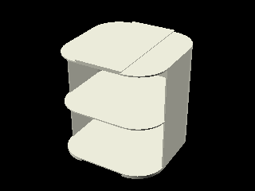

# whoop-box

A printable box system to store tiny-whoops.

<!-- vscode-markdown-toc -->

-   [At a glance](#Ataglance)
-   [Whoop boxes](#Whoopboxes)
-   [Angled boxes](#Angledboxes)
-   [Install and requirements](#Installandrequirements)
    -   [OpenSCAD](#OpenSCAD)
    -   [Source code](#Sourcecode)
        -   [Download the zip file](#Downloadthezipfile)
        -   [Get the code from the repository](#Getthecodefromtherepository)
    -   [Configuration](#Configuration)
-   [Render the parts](#Rendertheparts)
-   [Post-scripts](#Post-scripts)

<!-- vscode-markdown-toc-config
	numbering=false
	autoSave=true
	/vscode-markdown-toc-config -->
<!-- /vscode-markdown-toc -->

## <a name='Ataglance'></a>At a glance

The project contains designs for a box system for storing tiny-whoop quadcopters. The parts are designed using a scripting language, processed by [OpenSCAD](https://openscad.org/about.html). There is no ready to use 3D model files in the source code. If you are interested in such files, please look at the [released versions](https://github.com/jsconan/whoop-box/releases) which contains 3D model files built with default parameters. However, if you want to customize these parts, tailoring them with your measures, you should rather download the source code and then tweak the configuration files before generating your own 3D model files.

At that time, the project proposed 2 sets of boxes. The dimensions and the number of cells can be set from the [configuration](./config/config-dist.scad).

The size is defined by:

-   The distance between motors, on the [diagonal](./config/config-dist.scad#L59).
-   The diameter of [ducts](./config/config-dist.scad#L60).
-   The height of [ducts](./config/config-dist.scad#L61).
-   The overall height of the [whoop](./config/config-dist.scad#L62).
-   The [padding](./config/config-dist.scad#L63) added between the box wall and the whoop.

Several presets are available out of the box in the file [config/presets.scad](./config/presets-dist.scad). The currently selected preset is configured through the variable `preset` in the file [config/config.scad](./config/config-dist.scad#L56).

When using the [render](./render.sh) script, all presets can be rendered at once using the option `-a`. See the section **[Render the parts](#Rendertheparts)**. Otherwise, only one single preset is rendered at a time.

## <a name='Whoopboxes'></a>Whoop boxes

A second iteration on the project added simple boxes with padding inside to better wrap the tiny-whoop. Instead of multiple shells made of several materials, it only relies on a single box and its container.


This version proposes several variants of the box:

-   A padded box to contain a tiny-whoop


-   A box for spare parts


-   A box for propellers


-   A container for one or more boxes with respect to the configuration



## <a name='Angledboxes'></a>Angled boxes

Initially, the project was based on a set of wrapped boxes, to be printed in various materials (TPU, PLA, PET). The set was made modular, in order to either have a simple box to protect a tiny-whoop or to properly store several of them in a cupboard.


The proposed boxes are:

-   A rounded box to contain a tiny-whoop


-   An angled box to contain the rounded box


-   A drawer to contain one or more angled boxes with respect to the configuration


-   A cupboard to contain drawers with one or more angled boxes with respect to the configuration


## <a name='Installandrequirements'></a>Install and requirements

To properly use the project you first need to do some installations steps.

### <a name='OpenSCAD'></a>OpenSCAD

First of all you need [OpenSCAD](https://openscad.org/) to be installed. To do so, please go to the [OpenSCAD download page](https://openscad.org/downloads.html), an get the version suitable for your operating system.

### <a name='Sourcecode'></a>Source code

The source code is hosted on a [Git](https://git-scm.com/) repository. To get it you can either download a [zip file](https://github.com/jsconan/whoop-box/archive/refs/heads/main.zip), or clone the repository locally.

#### <a name='Downloadthezipfile'></a>Download the zip file

The source code can be downloaded from the [GitHub repository](https://github.com/jsconan/whoop-box).

You can download it as zip file from this [link](https://github.com/jsconan/whoop-box/archive/refs/heads/main.zip).

As the project is using a shared library, that is not supplied with the package, you will need to also download it.

Download the zip file from this [link](https://github.com/jsconan/camelSCAD/archive/refs/heads/main.zip).

Then extract its content inside the folder `lib/camelSCAD`. Please make sure the folder directly contains the library and not an intermediate folder like `lib/camelSCAD/camelSCAD-master`. If this is the case, please move the content one folder up and delete the extra folder.

Note: the easiest way is to call the `init.sh` script, that will take care of this for you.

#### <a name='Getthecodefromtherepository'></a>Get the code from the repository

A git tool is needed if you intend to get the source code from the git repository. You can download one either from the [main git website](https://git-scm.com/downloads), or from [GitHub](https://docs.github.com/en/github-cli).

Once you have your git tool installed, open a console window, select a project folder (create it if needed), then run the following commands:

```
git clone https://github.com/jsconan/whoop-box.git
cd whoop-box
git submodule init
git submodule update
```

The source code should have been downloaded, as well as the libraries.

Note: you can also use a graphical interface tool. In this case, please make it can also install the submodules.

Note 2: the easiest way is to call the `init.sh` script, that will take care of this for you.

### <a name='Configuration'></a>Configuration

The configuration may be changed locally. To not collide with changes in the main implementation, the configuration files are not versioned. Instead, you will find `-dist` files that contain a copy of the typical configuration.

From a fresh copy of the project, you will need first to create these configuration files. The easiest way is to call the `init.sh` script, that will take care of this for you. The configuration files will also be checked and created if needed each time the `render.sh` script is called.

This initial creation of the configuration files could also be done manually. Here is how:

1. Go to the `config` folder
2. Copy any of the files having a `-dist` suffix in their name to a file without this suffix.

    _Example:_ copy `config-dist.scad` to `config.scad`

## <a name='Rendertheparts'></a>Render the parts

The parts are all located into the `parts` folder. They can all be opened separately in [OpenSCAD](https://openscad.org/) and rendered.

However, it is possible to render all parts in batch. The script `render.sh` takes care of this.

This is a command-line tool, which accept several parameters. By default, it will render the preset selected in the config.

It is possible to select another preset, as well as set a different number of cells for the containers.

The parameter `-h` make it show the help.

Running the command `render.sh -h` will show this message:

```
Renders OpenSCAD files
  Usage:
	./render.sh [command] [-h|--help] [-o|--option value] files

  a,   all            Render all elements (default)
  n,   angled         Render the sets of angled boxes
  w,   whoop          Render the sets of whoop boxes
  -h,  --help         Show this help
  -p   --preset       Set size preset to apply
  -a,  --all          Render all presets
  -x,  --line         Set the number of boxes per lines in the container (X-axis)
  -y   --column       Set the number of boxes per columns in the container (Y-axis)
  -z   --depth        Set The number of boxes per lines and columns in the container (Z-axis)
  -f   --format       Set the output format
  -p   --parallel     Set the number of parallel processes
  -s   --slice        Slice the rendered files using the default configuration
  -c   --clean        Clean up the output folder before rendering
```

All presets can be rendered at once by calling the command `render.sh -a`.

The STL files are rendered to the `dist/stl` folder.

If the slicer [PrusaSlicer](https://github.com/prusa3d/PrusaSlicer) is installed, running the command `render.sh -s` will produce the [G-code](https://en.wikipedia.org/wiki/G-code) from the rendered STL files and using the setting from the file `config/config.ini`. Out of the box, it is produce instruction for PETG and a 0.2mm layer height.

## <a name='Post-scripts'></a>Post-scripts

When using the built-in script to render/slice the models in batch, you can also add custom post-processing scripts. There is one for `render.sh` and one for `slice.sh`. They are respectively named `post-render.sh` and `post-slice.sh`.

As these script can be defined locally, they are not part of the versioned content. Instead, you can find sample files at `post-render-dist.sh` and `post-slice-dist.sh`. To use them, you need to:

-   copy the dist file to a local file, for example: `cp post-render-dist.sh post-render.sh`.
-   you need to make sure the file is executable: `chmod +x post-render.sh`.
-   finally, add you own commands to the copy.

As an example:

-   The script used to zip the rendered files:

```sh
# Bootstrap the script
scriptpath=$(dirname $0)
source "${scriptpath}/lib/camelSCAD/scripts/utils.sh"

# Script config
project=$(pwd)
stlpath="${project}/dist/stl/"
zippath="stl.zip"
logpath="${project}/dist/zip.log"

# Post process the rendered files
printmessage "${C_MSG}==========================================="
printmessage "${C_MSG}Post-render script: zip files"
dummy=$(
    cd "${stlpath}"
    rm *.zip > /dev/null
    zip -r "${zippath}" *
)
printmessage "${C_MSG}==========================================="
```

-   The script used to copy the sliced files to a SD-card:

```sh
# Bootstrap the script
scriptpath=$(dirname $0)
source "${scriptpath}/lib/camelSCAD/scripts/utils.sh"

# Script config
project=$(pwd)
gcodepath="${project}/dist/gcode/"
sdcardpath="/PATH/TO/SD/CARD"
logpath="${project}/dist/gcode-sync.log"

# Post process the sliced files
printmessage "${C_MSG}==========================================="
printmessage "${C_MSG}Post-slice script: copy Gcode to the SDcard"
date > ${logpath}
createpath "${sdcardpath}"
rsync -ahvt --no-links --delete --partial --force --modify-window=1 --exclude=.DS_Store --log-file=${logpath} "${gcodepath}" "${sdcardpath}"
printmessage "${C_MSG}==========================================="
```
